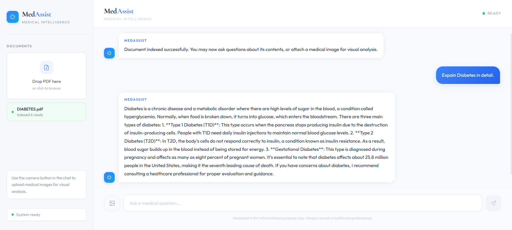

# MedAssist — AI Medical Intelligence


[](https://medical-assistant-chatbot-hazel.vercel.app)
[](https://medical-assistant-chatbot-6ixo.onrender.com)


---

## Screenshot




---

## Overview

**MedAssist** is a full-stack AI-powered medical assistant that allows users to upload medical documents (PDFs) and ask questions about them using Retrieval-Augmented Generation (RAG). It also supports medical image analysis using Google Gemini Vision.

> **Disclaimer:** MedAssist is for informational purposes only. Always consult a qualified healthcare professional for medical advice.

---

## Features

- **PDF Upload & Indexing** — Upload medical PDFs and index them into a vector database for semantic search
- **RAG-Powered Q&A** — Ask natural language questions about your medical documents
- **Medical Image Analysis** — Upload X-rays, prescriptions, or medical reports for AI-powered visual analysis
- **Table & Chart Extraction** — Extracts tables and structured data from PDFs using pdfplumber
- **Responsive UI** — Works seamlessly on desktop and mobile devices
- **Real-time Chat Interface** — Clean, modern chat UI with typing indicators

---

## Tech Stack

### Frontend


### Backend


### AI & Vector Store


---

## Architecture

```
User
 │
 ├── Upload PDF
 │     └── FastAPI → pdfplumber (extract text + tables)
 │           └── Gemini Embedding (gemini-embedding-001)
 │                 └── Pinecone (vector store)
 │
 └── Ask Question / Upload Image
       ├── Text Query
       │     └── Gemini Embedding → Pinecone similarity search
       │           └── LangChain RAG → Groq LLM (llama-3.3-70b)
       │                 └── Answer
       │
       └── Image Query
             └── Gemini Vision (analyze image)
                   └── Combined query → Pinecone → Groq LLM
                         └── Answer + Image Analysis
```

---

## Getting Started

### Prerequisites

- Python 3.12+
- Node.js 18+
- API Keys: Google AI, Pinecone, Groq

### Backend Setup

```bash
# Clone the repo
git clone https://github.com/yourusername/medical-assistant.git
cd medical-assistant/server

# Create virtual environment
python -m venv .venv
.venv\Scripts\activate  # Windows
source .venv/bin/activate  # Mac/Linux

# Install dependencies
pip install -r requirements.txt

# Create .env file
cp .env.example .env
# Add your API keys to .env

# Run the server
uvicorn main:app --reload
```

### Frontend Setup

```bash
cd medical-assistant/client

# Install dependencies
npm install

# Create .env.local file
echo "NEXT_PUBLIC_API_URL=http://127.0.0.1:8000" > .env.local

# Run the app
npm run dev
```

Open [http://localhost:3000](http://localhost:3000) in your browser.

---

## Environment Variables

### Backend (`server/.env`)

```env
GOOGLE_API_KEY=your_google_api_key
PINECONE_API_KEY=your_pinecone_api_key
GROQ_API_KEY=your_groq_api_key
```

### Frontend (`client/.env.local`)

```env
NEXT_PUBLIC_API_URL=http://127.0.0.1:8000
```

---

## API Endpoints

| Method | Endpoint | Description |
|--------|----------|-------------|
| POST | `/upload_pdfs/` | Upload and index PDF documents |
| POST | `/ask/` | Ask a text question |
| POST | `/ask_with_image/` | Ask a question with a medical image |

---

## Project Structure

```
medical-assistant/
├── client/                      # Next.js frontend
│   ├── app/
│   │   └── page.tsx             # Main page
│   ├── components/
│   │   ├── Sidebar.tsx          # PDF upload sidebar
│   │   ├── ChatWindow.tsx       # Chat messages
│   │   └── ChatInput.tsx        # Input bar
│   ├── hooks/
│   │   ├── useChat.ts           # Chat logic
│   │   └── useMobile.ts         # Responsive detection
│   └── lib/
│       └── api.ts               # API calls
│
└── server/                      # FastAPI backend
    ├── main.py                  # App entry point
    ├── routes/
    │   ├── upload_pdfs.py       # PDF upload endpoint
    │   ├── ask_question.py      # Text Q&A endpoint
    │   └── ask_with_image.py    # Image analysis endpoint
    ├── modules/
    │   ├── load_vectorstore.py  # PDF processing & embedding
    │   └── llm.py               # LangChain RAG chain
    └── requirements.txt
```

---

## Deployment

| Service | Platform | URL |
|---------|----------|-----|
| Frontend | Vercel | [medical-assistant-chatbot-hazel.vercel.app](https://medical-assistant-chatbot-hazel.vercel.app) |
| Backend | Render | [medical-assistant-chatbot-6ixo.onrender.com](https://medical-assistant-chatbot-6ixo.onrender.com) |

---

## License

This project is licensed under the MIT License.

---

<p align="center">Built with by Pratyush Singh</p>
